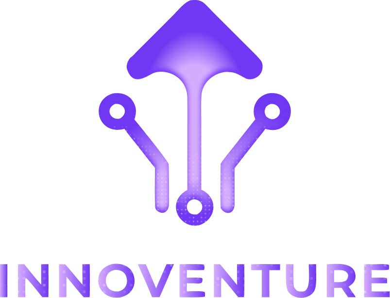

<div align="center">
  

  <h3 align="center">Innoventure HMIF - Chapter II</h3>

  <p align="center">
    <strong>"Code Your Passion, Create The Future, Be The Catalyst"</strong>
    <br />
    Event IT se-Jawa Barat untuk SMA/SMK
    <br />
    <br />
    <a href="#about-the-project">About</a>
    ·
    <a href="#features">Features</a>
    ·
    <a href="#getting-started">Installation</a>
  </p>
</div>

---

## 🚀 About The Project

**Innoventure** is an annual national technology event held by HMIF (Himpunan Mahasiswa Teknik Informatika). It aims to bridge the gap between academic learning and industry demands by challenging students to solve real-world problems.

Whether you're a coder, a designer, or an esports enthusiast, Innoventure provides the perfect stage to showcase your talents and network with industry professionals.

### Competition Branches
1. **Web Development** - Build innovative web applications that solve modern challenges.
2. **UI/UX Design** - Craft beautiful and intuitive user experiences.
3. **Mobile Legends** - Intense esports tournament.

---

## 🛠 Tech Stack

This project uses a modern web stack tailored for high performance and excellent developer experience:

* **Backend:** [Laravel 11](https://laravel.com)
* **Frontend:** [React.js](https://reactjs.org/) + [Vite](https://vitejs.dev/)
* **Styling:** [Tailwind CSS](https://tailwindcss.com/)
* **Admin Panel:** [Filament PHP](https://filamentphp.com/)
* **Database:** MySQL / PostgreSQL

---

## ✨ Features

* **Multi-Role Authentication:** Supports custom roles (Admin, Peserta WebDev, Peserta UI/UX, Peserta ML).
* **Participant Dashboard:** Dedicated portals for competition submissions (e.g. GitHub links, Figma links, Pitch Decks).
* **Live Leaderboard:** Real-time tracking of assessment scores.
* **Seminar Ticketing:** Registration and ticketing portal for the Grand Tech Seminar.
* **Responsive Design:** Fully responsive layout with premium aesthetics (dark mode, glassmorphism, dynamic animations).

---

## ⚙️ Getting Started

Follow these steps to set up the project locally.

### Prerequisites

Ensure you have the following installed on your machine:
* PHP >= 8.2
* Composer
* Node.js & npm
* MySQL or compatible database

### Installation

1. **Clone the repository**
   ```sh
   git clone https://github.com/Rifqi1012/innnoventure-hmif.git
   cd innnoventure-hmif
   ```

2. **Install PHP dependencies**
   ```sh
   composer install
   ```

3. **Install NPM dependencies**
   ```sh
   npm install
   ```

4. **Environment Setup**
   Copy the example `.env` file and generate the application key:
   ```sh
   cp .env.example .env
   php artisan key:generate
   ```
   *Note: Don't forget to configure your database credentials (`DB_DATABASE`, `DB_USERNAME`, `DB_PASSWORD`) in the `.env` file.*

5. **Run Migrations & Seeders**
   This command will build the database tables and populate it with initial data, including the participant accounts from the CSV files.
   ```sh
   php artisan migrate:fresh --seed
   ```

6. **Create Storage Link**
   Required to display uploaded images (like Medpart & Sponsor logos):
   ```sh
   php artisan storage:link
   ```

7. **Run the Development Servers**
   You need to run both the Laravel backend server and the Vite frontend compiler:
   
   *Terminal 1 (Backend):*
   ```sh
   php artisan serve
   ```
   
   *Terminal 2 (Frontend):*
   ```sh
   npm run dev
   ```

8. **Access the App**
   Open `http://localhost:8000` in your browser.

---

## 👥 Default Accounts

After running the seeders, you can log in using the following roles. See `database/seeders` for the complete list.

**Admin:**
* **Email:** `admin@innoventure.com` (or your configured admin email)
* **Password:** (Check your `DatabaseSeeder`)

**Peserta WebDev (Example):**
* **Email:** Check the `akun_peserta_webdev.csv`
* **Password:** Provided in the CSV

**Peserta UI/UX (Example):**
* **Email:** `risya-nur-amelia24@innoventure.com`
* **Password:** `UoL775jF`

---

## 🎨 Design Philosophy

The UI is built with a **Premium Dark Aesthetic** in mind, utilizing:
- Vibrant gradients (`brand-purple` to `brand-pink`)
- Blurred backdrops (Glassmorphism)
- Scroll reveal animations
- Fully responsive mobile-first layouts

---

<div align="center">
  <p>Built with ❤️ by the Innoventure HMIF Tech Team</p>
</div>
